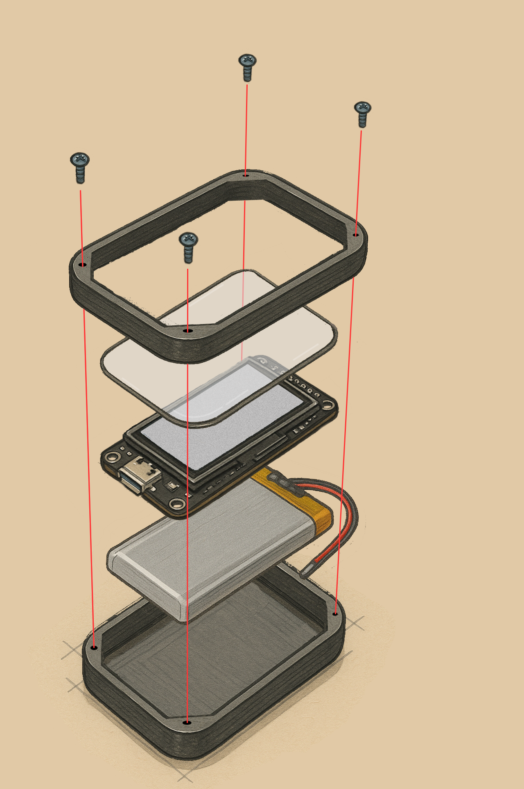
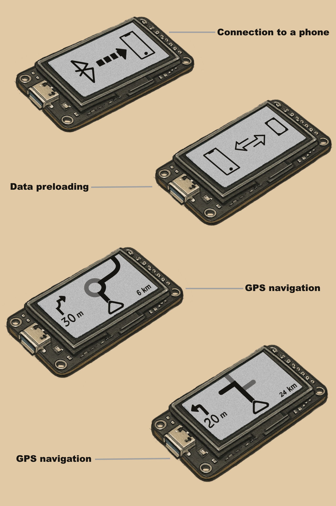

# ESP32-Véhicule-Navigation

## Inspiration

Ce projet s'inspire du concept de l'appareil **Beeline**, un système de navigation minimaliste dédié aux deux-roues, reconnu pour son design épuré et son efficacité. Toutefois, Beeline reste un produit coûteux et fermé, ce qui limite son accessibilité et sa personnalisation.

Ce projet vise à proposer une alternative **open-source, économique et personnalisable**, en affichant des informations de navigation GPS sur un petit écran (+ESP32).  

L’objectif est de permettre aux conducteurs de **voiture, moto, vélo, trottinette..** de suivre leur itinéraire de manière simple et intuitive, **sans avoir à consulter leur téléphone**.

Les informations affichées incluront :
- Les instructions de navigation:
  - Affichage du tracé de l’itinéraire sur la carte sous forme de ligne vectorielle.
  - Fleche directionnelle (tourner à droite..).
  - Distance restante avant la prochaine instruction de navigation (ex: "50 mètres").
- Le temps restant avant d’arriver à destination.
- L’heure d’arrivée estimée.

L'interface sera volontairement **compacte, claire et non intrusive**, pensée pour une lecture rapide pendant la conduite.

## Documentation

Pour mieux comprendre l’architecture et les choix métiers, consultez les fichiers suivants :

- [Roadmap de recherche (pistes & orientations)](documentation/01_research_roadmap.md)
- [Solutions existantes comparées](documentation/02_existing_solutions.md)
- [Solutions envisagées (comparatif)](documentation/03_proposed_solutions.md)

## ESP32 Project – Système embarqué avec vue éclatée technique

**Vue éclatée de l’appareil**:

- **Coque**: Impression 3D en PLA.
- **Verre protecteur**: Offre une protection supplémentaire contre:
  - les rayures liées à l’usage quotidien,
  - les chocs légers, 
  - les projections d’eau légères, comme des gouttes de pluie occasionnelles.
- **ESP32/Display**: Microcontrôleur avec écran intégré.
- **Batterie LiPo 3.7V**: Alimentation rechargeable, placée en fond de boîtier.

## ESP32 Project – Aperçus de l'interface utilisateur (Mockup)
1. Connexion au téléphone via Bluetooth.
2. Écran de préchargement des données.
3. Vue de la navigation.

